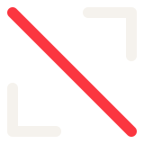

# BRAND — Coded Atlas

Diretrizes de marca do **Coded Atlas**, a ferramenta interna da **Coded by M** que transforma sites e produtos digitais em mídia de apresentação. A versão visual destas regras está em `docs/brand/atlas-brand.html` (abre no navegador).

A marca do Atlas é uma **submarca** da Coded by M. Ela não cria uma linguagem paralela: usa as mesmas cores, fontes e gramática de símbolo do design system da Coded by M (`docs/design-system/coded-by-m/`, `docs/DESIGN-SYSTEM.md`). Em conflito, o design system da Coded by M vence.

## Conceito

**Enquadrar e cortar.**

- O **visor** (dois cantos de enquadramento) é o que o Atlas faz: captura um produto digital e o enquadra como mídia.
- A **diagonal vermelha** é o sinal da Coded by M: a incisão, a decisão de edição. É o mesmo traço do símbolo-mãe, na mesma direção.

O símbolo fala do produto, não da letra. Por isso ele convive com o símbolo da Coded by M sem competir com ele.

## Símbolo

### Construção

Quadro de **160 × 160**. Três traços com ponta arredondada (`stroke-linecap: round`) e cantos arredondados (`stroke-linejoin: round`):

| Traço | Path | Cor |
|---|---|---|
| Canto superior direito | `M98 14 H146 V62` | estrutura (off-white `#F5F2ED`) |
| Canto inferior esquerdo | `M14 98 V146 H62` | estrutura (off-white `#F5F2ED`) |
| Diagonal | `M14 14 L146 146` | sinal (`#FB3640`) |

- Os braços de cada canto medem 48 unidades; o vão entre a ponta do canto e a diagonal é o que deixa o símbolo respirar. Não feche os cantos nem encoste a diagonal neles.
- A diagonal vai **de cima-esquerda para baixo-direita**, como a do símbolo da Coded by M. Nunca inverta.
- Espessura do traço: **12** (padrão, 48 px ou mais) ou **18** (pequeno, abaixo de 40 px). A proporção entre os traços é sempre igual: os três têm a mesma espessura.

### Arquivos

| Arquivo | Uso |
|---|---|
| `public/brand/atlas-symbol.svg` | padrão, sobre fundo escuro, 48 px ou mais |
| `public/brand/atlas-symbol-small.svg` | traço grosso, sobre fundo escuro, 16–40 px |
| `public/brand/atlas-symbol-on-light.svg` | sobre fundo claro (cantos em `#000F08`, diagonal no sinal) |
| `public/brand/atlas-symbol-mono-light.svg` | uma cor, off-white (impressão, marca d'água sobre escuro) |
| `public/brand/atlas-symbol-mono-dark.svg` | uma cor, `#000F08` (impressão, marca d'água sobre claro) |
| `app/icon.svg` | ícone da aba / app: símbolo pequeno sobre quadrado `#0A0A0A` |
| `components/ui/atlas-mark.tsx` | componente React; escolhe o traço pelo tamanho |

### Tamanho mínimo e respiro

- Mínimo: **16 px** (só com a versão de traço grosso). Abaixo de 40 px, sempre a versão pequena.
- Área de respiro: **¼ da largura do símbolo** em volta (40 unidades no quadro de 160). Nada de texto, borda ou imagem dentro dela.

### Ícone do app

O único "fundo" do símbolo é o quadrado do ícone: `#0A0A0A`, **cantos retos** (radius 0, regra da Coded by M), símbolo pequeno com margem de ~10% em cada lado. Existe porque o off-white some nas abas claras do navegador. Fora do ícone, o símbolo fica direto sobre o fundo.

## Assinatura (símbolo + nome)

- Nome em **Panchang 700**, caixa alta: **CODED ATLAS**, tracking `0.04em`.
- Altura do símbolo ≈ **1,25 × a altura das maiúsculas**; espaço entre símbolo e nome ≈ **0,6 × a altura do símbolo**.
- Na barra do app: símbolo 16 px + nome 13 px.
- Em texto corrido o nome é escrito **Coded Atlas** (sem caixa alta, sem "o" antes quando for título).
- Quando a assinatura precisa mostrar a origem: **Coded Atlas — by Coded by M**, com "by" no sinal, como no wordmark da Coded by M.

## Cores

| Papel | Valor | Onde |
|---|---|---|
| Estrutura | `#F5F2ED` off-white | cantos do símbolo, texto, nome |
| Sinal | `#FB3640` | diagonal do símbolo; ação principal, foco. Raro: no máximo 2–3 por tela |
| Sinal escuro | `#C42030` | hover do sinal, vermelho de texto sobre claro |
| Base da marca | `#000F08` | fundo das peças "Coded by M"; cantos do símbolo sobre claro |
| Base da interface do Atlas | `#0A0A0A` / `#111111` / `#171717` | fundo, painéis e campos do app (ADR-049) |
| Cinzas quentes | `#E8E4DE` `#C8C4BE` `#8A8780` | texto secundário; nada legível abaixo de `#8A8780` |

O vermelho nunca vira cor de fundo grande, gradiente ou brilho. Branco puro e preto puro não existem na marca.

## Tipografia

- **Panchang** (500–800): nome do produto, títulos de página, botão principal. Larga — use corpo menor que o de uma grotesca.
- **Satoshi** (300–700): todo o resto. Micro-rótulos em Satoshi 500, caixa alta, tracking largo (`0.22em`).
- Arquivos em `public/fonts/cbm/` (servidos localmente; nada de CDN).

## Movimento

O símbolo é **desenhado, não colocado** (regra 5.6 da Coded by M):

1. os dois cantos se desenham juntos (`stroke-dashoffset`, ~300 ms, ease-out);
2. a diagonal entra **por último e mais rápido** (~180 ms), como uma incisão.

Sem bounce, sem rotação, sem pulsar. Com `prefers-reduced-motion`, o símbolo aparece pronto.

## Usos errados

- Girar, espelhar ou inverter a direção da diagonal.
- Trocar as cores entre si (cantos vermelhos, diagonal off-white) ou usar outra cor de destaque.
- Mudar a espessura de um traço só, ou usar ponta reta.
- Fechar o visor (quadrado completo) ou encostar a diagonal nos cantos.
- Colocar dentro de círculo ou de quadrado com cantos arredondados.
- Sombra, brilho, gradiente, contorno ou efeito 3D.
- Esticar ou achatar (o quadro é sempre quadrado).
- Usar sobre foto ou fundo com textura sem uma área lisa por trás.
- Usar no lugar do símbolo da Coded by M em peças de cliente: o Atlas é a ferramenta, a assinatura das peças é da Coded by M.

## Relação com a Coded by M

| | Coded by M | Coded Atlas |
|---|---|---|
| Papel | marca do estúdio | ferramenta interna do estúdio |
| Símbolo | "M" de construção: duas estruturas + diagonal | visor: dois cantos + diagonal |
| Gramática | traço arredondado, estrutura off-white, um corte no sinal | a mesma |
| Onde aparece | site, peças, propostas, redes | só no próprio Atlas (app, ícone, documentação) |

As peças que o Atlas gera assinam como **Coded by M**, nunca como Coded Atlas.
